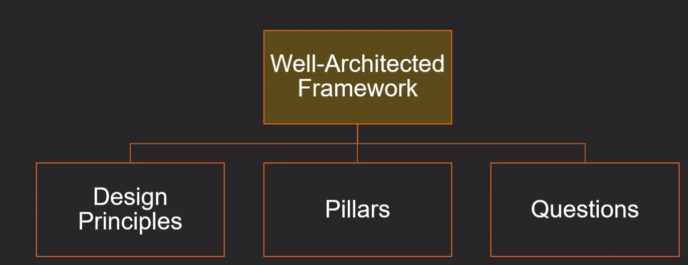
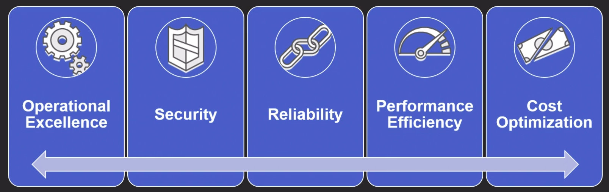

# Well-Architected

O Well-Architected Framework foi desenvolvido para ajudar os arquitetos de nuvem a criar uma infraestrutura com os mais altos níveis de segurança, performance, resiliência e eficiência possíveis para seus aplicativos. Baseado em cinco pilares, excelência operacional, segurança, confiabilidade, eficiência de performance e otimização de custos, o Framework fornece uma abordagem consistente para que clientes e parceiros avaliem arquiteturas e implementem designs que serão escalados ao longo do tempo.

- Cobre estratégias e melhores práticas para arqutetura em cloud computing.
- Ele provê uma maneira de mensurar sua arquitetura de acordo com as recomendações da AWS, corrigindo deficiênias e endereçando de melhoria.
- Decisões mais assertivas, pensamento cloud-native e potencial impacto ao negócio.
- Melhora da conscientização sobre as melhore práticas de arquitetura.
- Endereça áreas de base (fundamentos) que frequentemente são negligenciadas.
- Provê uma abordagem conistente para avaliação da arquitetura.

## General principles design

- Não é preciso estimar (adivinhar) a capacidade requerida.
- Testes podem ser realizados em escala de produção.
- Crie e experimento facilmente as soluções.
- Permite a criação e evolução da arquitetura.
- Soluções são criadas em base nas necessidades (data-driven).
- Melhore através de `game days` (eventos em produção).

## Fundamentado em pilares

Baseado em cico pilares, excelência operacional, segurança, confiabilidade, eficiência de performance e otimização de custos, o Framework fornece uma abordagem consistente para que clientes e parceiros avaliem arquiteturas e implementem designs que serão escalados ao longo do tempo.

- **Execelência operacional:** se concentra em `executar` e `monitorar` sistemas entregar valor empresarial e melhorar continuamente processos e procedimentos. Os principais incluem gerenciamento e automação de alterações, reação a eventos e definição de padrões para gerenciar com êxito as operações diárias.
- **Segurança:** se concentra em proteger informações e sistemas. Os principais tópicos incluem `confiabilidade` e `integridade de dados`,identificação e gerenciamento de quem pode fazer o quê como o gerenciamento de privilégios, proteção de sistemas e estabelicimento de controles para detectar eventos de segurança.
- **Confiabilidade:** se concentra na capacidade de eveitar e se recuperar rapidamente das falhas para atender a demanda comercial e de clientes. Os principais tópicos incluem elementos básicos sobre configuração, requisitos entre projetos, planejamento e recuperação e como lidamos com as mudanças.
- **Eficiência de performance:** se concentra no uso eficiente de recursos de TI e computação. Os principais tópicos incluem seleção dos tipos e dos tamanhos certos dos recursos, tomando como base os requisitos de carga de trabalho, a performance do monitoramento e a tomada de decisões fundamentadas para manter a eficiência à medida que as necessidades comerciais evoluem.
- **Otimização de custos:** visa a evitar gastos desnecessários. Os principais tópicos compreensão e controle de onde o dinheiro está sendo gasto, seleção do núero certo e mais adequado dos tipos de recurso, análise dos gastos ao longo do tempo e escalabilidade para atender às necessidades de negócios sem gastar excessivamente.

## Usos comuns do Well-architected

- Aprender como criar arquiteturas nativas de cloud.
- Construir um base de conhecimento para mitigar falhas técnicas e riscos.
- Utilização como um mecanismo de padronização e governança antes da produção.
- Comparar a maturidade enre diferentes times, sistemas e produtos.
- Apresentar ao mercado características de `due-dilligence`.

---

# Execelência operacional

>> Alguns pilares podem ser adequados a cada tipo de realidade nas organizações como (`Reliability`, `Performance efficiency` e `Cost optimization`), porém **`Operational Excellence` e `Security` são pré-requisitos**.

## Design principles

- Perform operations as code (Execute a operação como código)
- Annotate documentation (anotar documentação)
- Make frequent, small, reversible changes (Alterações frequentes, peguenas e reversíveis)
- Refine operations procedures frequently (Refine os procedimentos de operação frequentemente e melhorias)
- Anticipate failure (Antecipação as falhas)
- Learn from all operational failures (Aprenda com todas as falhas na operação)

### Melhores praticas

#### 1 - Preparar/Planejar

- Business (solicitações workload)
- Checklist (validação)
- Treinamento (capacitação do time)
- Experimentação (testar time)

#### 2 - Operar

- Saúde da operação (monitoramento, metricas operacionais, Runbook "descrição e padronização do ambiente" e playbook "respostas automatizadas tratadas no playbook")
- Insigts técnicos e de negócios (Metricas voltadas ao negócio)
- Resposta a eventos (Automatização de resposta a eventos)

#### 3 - Evoluir

- Ciclos de melhorias incrementais
- Revendo as prioridades definidas
- Provendo feedback as áreas da empresa
- Compartilhando lições aprendidas e as oportunidades de melhorias das análises efetuadas
- `DevOps` para codificação, testes e deploy contínuo de forma automatizada na empresa

### Serviços Chaves AWS

Alguns serviços da aws para lhe auxiliar na execelência operacional

- CloudFormation (IaC)
- CloudWatch (Monitoramento)
- VPC Flow logs (Monitoramento do trafego de um VPC)
- Cloud trail (Autoria de chamadas de API)
- Config (Automatização e padronização de recursos)
- Elasticsearch (Analise de tedências)
- X-Ray (Visibilidade do workload)
---

# Segurança

### Design principles

- Implement a strong identify foundation (Implemente uma gestão de identidades bem fundamentada)
  - Privilegio minimo  
  - Separation of duties
  - Centralização da gestão de identidades
  - ~~Long-term credentials~~ (Utilize roles com permissões temporárias)
- Enable tracebility (Permitir a rastreabilidade)
- Apply security at all layers (Apligue segurança em todas as camadas)
- Automate security best pratices (Automatize as melhores práticas de segurança `IaC`)
- Protect data in trasit and at rest (Proteja os dados em trânsito e descanso)
- Keep people away from data (Mantenha as pessoas longe dos dados)
- Prepare for security events (Prepare-se para eventos de segurança)

#### Identify and Access management

- Somente o pessoal autorizado e autenticado tenha acesso aos recursos da maneira prevista.
  - AWS Shared Responsibility Model
  
- Estrutura bem definida de gerenciamento de privilégios, como políticas de acesso com granularidade.
- Política de senhas fortes, Multi-factor authentication (MFA), Federação de diretórios e Credenciais temporárias.

#### Detective controls

- Controles detectivos devem ser utilizados para identificar potenciais ameaças de segurança ou incidentes, EX:
  - Avaliação de inventário de ativos e auditoria interna
- Implementação de controles que possam identificar e reagir a qualquer atividade anormal. Através do processamento de logs, eventos e monitoramento. Análise automatizadas e alarmes em tempo real.
- Gerencimaneto de logs é essencial para responder a eventos de segurança, análise forense e compliance com requisitos legais.

#### Infrastructure protection

- Proteção da infraestrutura inclui defesa em profundidade (múltilas camadas de defesa).
- Podem ser implementadas estratégias de segmentação de redes (pública e privada), inspeção de pacotes, isolamento de recursos, topologia de redes (gateway, tabelas de roteamento, etc.)
- Enforcement de tráfego de entrada e saída, monitoramento dos acessos e alertas.
- Hardening de sitema operacional e escolha de serviços gerenciados pela aws.

#### Data protection

- Classificação de dados para a proteção das informações (controle criptográficos, níveis de acesso, etc.).
- O cliente mantêm o controle completo sobre os dados, podendo utilizar serviços da AWS para proteger a confidencialidade e integridade dos dados.
- Logs detalhados de acesso, mecanismos de recuperação e durabilidade dos dados devem ser planejados. Podendo ser adotadas estratégias de replicação e gerenciamento do ciclo de vida dos dados.

#### Incident response

- Ainda que controles detectivos e de prevenção estejam implantados é necessário um processo de resposta a incidentes de segurança, mitigando os impactos que possam advir na operação e nos objetivos de negócios.
- A arquite do workload afeta diretamente a habilidade em responder a um incidente de segurança, isolando, contendo e restaurando a operação a um estado normal.
- Ferramentas e automatização devem ser configurados para responder a incidentes, logs poderão ser analizados e utilizados na resposta.

## Serviços chaves

- Identify and Access management (IAM)
- CloudWatch
- VPC - (Segmentação de redes (pública e privada), inspeção de pacotes, isolamento de recursos, topologia de redes (gateways, tabelas de roteamentos, etc.))
  - subnet
- Cloud Trail
- Config
- Organizations
- KMS
- WAF
- Shield
- CloudFront (CDN)

---

# Confiabilidade

> O pilar de confiabilidade se concentra na capacidade de evitar e se recuperar rapidamente das falhas para atender a demanda comercial e de clientes.

## Design principles

- Test recovery procedures (Testar procedimentos de recuperação)
- Automatically recover from failure (Recuperação automática de falhas)
- Scale horizontally to increase aggregate system availabilit (Escalar horizontalmente para aumentar a disponibilidade do sistema como um todo)
- **Stop guessing capacity** (Para de desperdiçar capacidade)
- Manage change in automation (Gerencie mudanças por automação)

## Foundation

- Antes de arquitetar qualquer sistema os recursos de base (fundamentos) que influenciam a confiabilidade do sistema devem estar reservados.
- A alocação de recursos deve olhar entre projetos, evitando a negligência de considerar uma única demanda dentro da empresa.
- No ambiente de computação em nuvem os recursos de base são de responsabilidade do provedor, cabendo ao cliente selecionar os recursos e capacidade apropriadas ao seu workload visando a confiabilidade.

## Change management

- Esteja ciente de como as mudanças afetam os sistemas para planejar proativamente. O monitoramento vai permitir que tendências sejam identificadas evitando problemas de capacidade ou quebra de SLAs.
- A arquitetura do sistema deve prever mudanças automatizadas no ambiente para aumentar ou reduzir capacidade de forma automatizada (`self-heal`).
- Controles no processo de gerenciamento de mudanças devem assegurar que o *enforcement* de regras sejam aplicados ao ambiente, garantido a confiabilidade do sistema somente de mudanças autorizadas.

## Failure management

- Falhas são esperadas em qualquer sistema com uma complexidade razoável. É importante ter ciência desssas falhas responder adequadamente e prevenir que ela volte a ocorrer.
- Você deve utilizar do monitoramento e automação para reagir aos eventos de falha.
- Backups e restore regulares deverão se efetuados para assegurar a recuperação seja no nível lógico ou físico. RTO (Recovery Time Objectives) e RPO (Recovery Point Objectives) devem estar definidos, sendo testado continuamente o processo de falhas e recuperação para garantir seu atendimento.
  - RTO (Recovery Time Objectives) - Representa quantas horas você leva para retornar a um estado de trabalho após um desastre..
  - RPO (Recovery Point Objectives) - Quanto tempo minha aplicação pode ficar offiline.

## Serviços chave

- **Amazon CloudWatch**
- IAM
- Trusted advisor
- CloudTrail
- Config
- Shield
- Cloud formation
- Auto scaling

***
# Referência

- [Well-Architected](https://aws.amazon.com/pt/architecture/well-architected/)
- [AWS Artifact](https://aws.amazon.com/artifact/?nc1=h_ls)
- [AWS Shared Responsibility Model](https://wa.aws.amazon.com/wat.concept.sharedrspmodel.en.html)
- [Overview Shared Responsibility Model](https://aws.amazon.com/compliance/shared-responsibility-model/?ref=wellarchitected)
- [Disaster recovery](https://aws.amazon.com/pt/disaster-recovery/)
